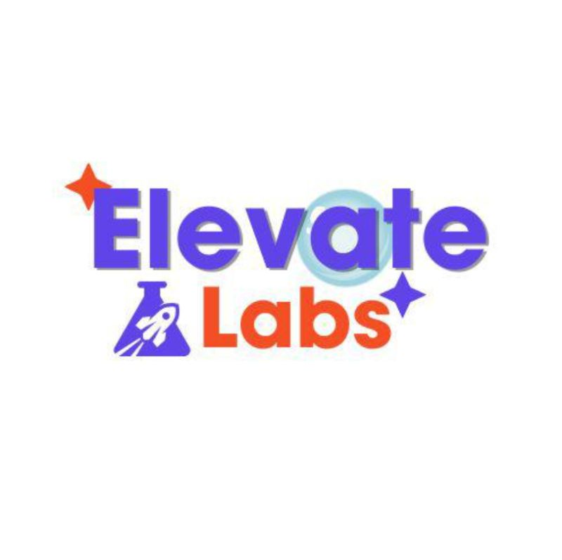

  

# Elevate-Labs-Final-Project-Customer-Lifetime-Value-Prediction
Machine Learning project to predict Customer Lifetime Value (CLV) using Random Forest and XGBoost with customer segmentation and business insights.
Customer Lifetime Value (CLV/LTV) Prediction Model
Objective

Predict the lifetime value (LTV) of customers based on their historical purchase behavior, to help the business prioritize retention efforts and target marketing spend more effectively.

Dataset

Online retail transaction dataset (online_retail_II.csv) — ~1.06M rows containing Invoice, StockCode, Description, Quantity, InvoiceDate, Price, Customer ID, and Country.

Note: the raw dataset is not included in this repo due to its size (~95MB). Download it from the original source and place it in the project folder before running the notebook.

Tools & Libraries
Python
Pandas, NumPy
Scikit-learn (Random Forest Regressor)
XGBoost (XGBRegressor)
Matplotlib, Seaborn
Excel (for the exported .xlsx predictions file)
Approach
Data Cleaning — removed rows with missing Customer ID / Description, dropped duplicates, removed cancelled invoices (Invoice IDs starting with 'C'), and filtered out invalid (non-positive) Quantity and Price values.
Feature Engineering — aggregated transactions to customer level and engineered:
Recency — days since last purchase
Frequency — number of unique invoices
Monetary — total historical spend (used as the LTV proxy/target)
AOV — Average Order Value
Purchase Span — days between first and last purchase
Total Quantity — total units purchased
Modeling — trained and compared two regressors:
Random Forest Regressor
XGBoost Regressor
The better-performing model (by R² Score) is automatically selected for final predictions.
Evaluation — MAE, RMSE, and R² Score on a held-out test split.
Segmentation — customers grouped into Low / Medium / High Value segments based on predicted LTV (top 10% = High Value, next 40% = Medium Value, rest = Low Value).
Results
Model	MAE	RMSE	R² Score
Random Forest	556.73	8489.75	0.8015
XGBoost (selected)	313.37	2376.45	0.9844

XGBoost was selected as the final model based on its significantly higher R² and lower error.

Customer segments (out of 5,878 total customers):

High Value: 588
Medium Value: 2,351
Low Value: 2,939
Key Insight

Total Quantity, Recency, and Frequency were the most influential features in predicting customer LTV — customers who buy more often, more recently, and in larger volumes tend to have higher lifetime value. This suggests loyalty programs, re-engagement campaigns for at-risk customers, and volume-based incentives are good levers for increasing LTV.

Repository Contents
File	Description
Customer_LTV_Prediction.ipynb	Full notebook — data cleaning, EDA, feature engineering, modeling, evaluation, segmentation
customer_ltv_model.pkl	Trained model (best performing, saved with joblib)
ltv_predictions.csv / ltv_predictions.xlsx	Final predicted LTV and segment for each customer
model_comparison.csv	Random Forest vs XGBoost metrics
missing_values.png, segment_distribution.png, feature_importance.png	Visualizations
How to Run
bash
pip install pandas numpy scikit-learn xgboost matplotlib seaborn joblib openpyxl
jupyter notebook Customer_LTV_Prediction.ipynb

Make sure online_retail_II.csv is in the same folder as the notebook before running.
